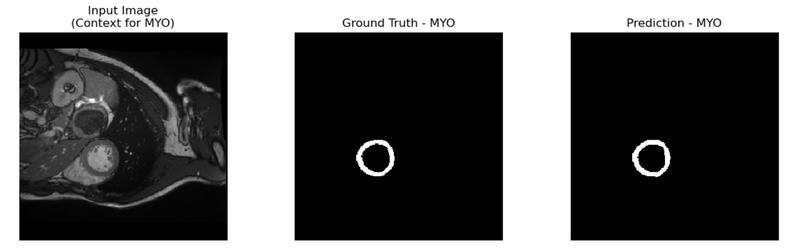
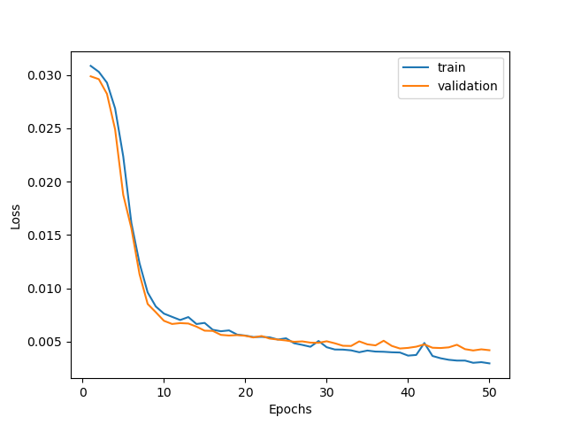
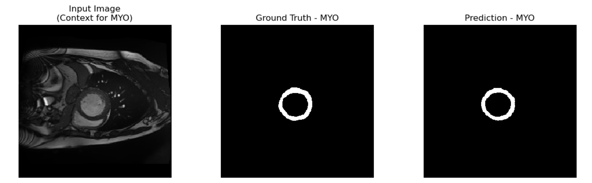
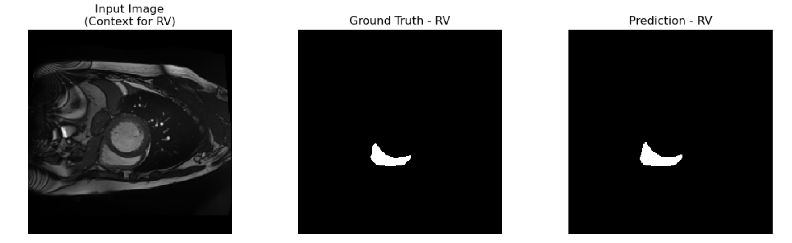
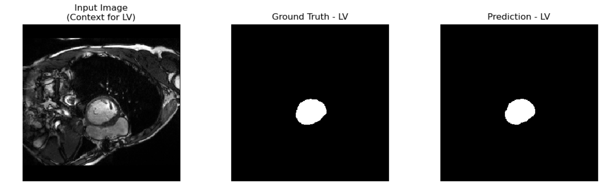
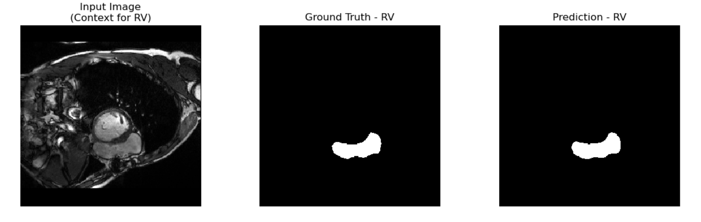

# Deep-learning-Cardiac-Cine-MRI-Segmentation

**BME1312 Artificial Intelligence in Biomedical Imaging**
ShanghaiTech University

> Members: 熊闻野, 夏博扬, 杨人一, 吴家兴, 杨丰敏

## Overview

*   **Goal:** Segment key cardiac structures – LV (Left Ventricle), MYO (Myocardium), and RV (Right Ventricle).
*   **Challenge:** Accurate and robust delineation of these structures, which can vary in shape and appearance.
*   **Approach:** U-Net based deep learning framework.
    1.  Baseline U-Net implementation.
    2.  Impact of removing U-Net skip connections.
    3.  Effect of data augmentation.
    4.  Comparison of Binary Cross-Entropy vs. Soft Dice Loss.
    5.  Improvements with Attention mechanism.
*   **Evaluation:** Dice Similarity Coefficient (DSC).

## Task (a): U-Net (Baseline)

  

### Baseline Training Loss and Validation Loss

  

### Results: Dice Coefficients

| Structure | Mean Dice | Std. Dev. |
| :-------- | :-------- | :-------- |
| RV        | 0.9519    | 0.0086    |
| MYO       | 0.8734    | 0.0161    |
| LV        | 0.8920    | 0.0310    |

### Segmentation Examples

  
  <em>Baseline Segmentation Example LV</em>

 

  
  <em>Baseline Segmentation Example MYO</em>

 

  
  <em>Baseline Segmentation Example RV</em>

### Discussion - Baseline

*   **RV Segmentation**: Achieved the highest mean Dice score. This is often expected as the RV is typically a large, relatively well-defined structure with good contrast against surrounding tissues in many MRI sequences.
*   **LV Segmentation**: Also showed good performance. The LV cavity is usually clearly visible.
*   **MYO Segmentation**: Had the lowest mean Dice score. The myocardium is a thinner, more complex structure surrounding the LV, and its boundaries, especially with the LV cavity (endocardium) and epicardium, can be more challenging to delineate accurately, potentially leading to lower overlap scores.
*   The standard deviations are relatively small, indicating consistent performance across the test slices.

## Task (b): U-Net without Skip Connections

*   **Modification:** No skip connections in the U-Net architecture.
*   **Training:** Same as baseline (BCE Loss, lr=0.01, 50 epochs).
*   **Purpose:** Evaluate the importance of skip connections.

### Training Loss and Validation Loss (No Skip Connections)

  
  <em>Training and Validation Loss for Baseline U-Net without skip connections.</em>

### Results: Dice Coefficients

| Structure | Baseline DSC | No Shortcut DSC |
| :-------- | :----------- | :-------------- |
| RV Mean   | **0.9519**   | 0.9260          |
| MYO Mean  | **0.8734**   | 0.8223          |
| LV Mean   | **0.8920**   | 0.8588          |
| RV std    | 0.0086       | 0.0111          |
| MYO std   | 0.0161       | 0.0168          |
| LV std    | 0.0310       | 0.0296          |

### Discussion - Impact of No Skip Connections

*   **Significant Drop in Performance:** All structures showed a noticeable decrease in DSC.
*   **Reason:** Skip connections provide high-resolution spatial information from the encoder to the decoder, crucial for accurate boundary localization. They also aid gradient flow.
*   **Conclusion:** Skip connections are vital for U-Net's segmentation accuracy in this task.

## Task (c): U-Net with Data Augmentation

*   **Network:** Baseline U-Net architecture.
*   **Augmentations (Training Set Only):**
    *   `RandomHorizontalFlip`
    *   `RandomRotation(15°)`
    *   `RandomAffine(degrees=50, translate=(0.1,0.1), scale=(0.9,1.1), shear=5)`
*   **Implementation:** `SegmentationDataset` ensuring identical transforms for image and mask.
*   **Training:** BCE Loss, lr=0.01, 50 epochs.

### Training Loss and Validation Loss (with Data Augmentation)

  
  <em>Training and Validation Loss for Baseline U-Net with Data Augmentation.</em>

### Results: Dice Coefficients

| Structure | Baseline DSC | Data Aug. DSC |
| :-------- | :----------- | :------------ |
| RV Mean   | **0.9519**   | 0.9276        |
| MYO Mean  | **0.8734**   | 0.8469        |
| LV Mean   | **0.8920**   | 0.8635        |
| RV std    | 0.0086       | 0.0107        |
| MYO std   | 0.0161       | 0.0149        |
| LV std    | 0.0310       | 0.0384        |

### Discussion - Impact of Data Augmentation

*   **DSC Decrease:** The specific augmentation strategy led to slightly lower Dice scores.
*   **Possible Reasons:**
    *   Some augmentations could have distorted anatomical structures, reducing the effectiveness of learning precise boundaries. The relative location of structures might have been altered too much.
*   **Conclusion:** The relative location of structures is crucial for segmentation tasks, and the specific augmentations used may not have been beneficial for this dataset. More careful selection or tuning of augmentations is needed.

## Task (d): U-Net with Soft Dice Loss

*   **Network:** Baseline U-Net architecture.
*   **Training Data:** Original Non-Augmented Training Set.
*   **Loss Function:** `SoftDiceLoss`.
*   **Optimizer:** Adam (lr=0.001), ExponentialLR scheduler.
*   **Training:** 50 epochs.

### Training Loss and Validation Loss (With Soft Dice Loss)

  
  <em>Training and Validation Loss for Baseline U-Net with Soft Dice Loss.</em>

### Results: Dice Coefficients

| Structure | Baseline with BCE Loss | Baseline with Soft Dice Loss |
| :-------- | :--------------------- | :--------------------------- |
| RV Mean   | 0.9519                 | **0.9566**                   |
| MYO Mean  | 0.8734                 | **0.8962**                   |
| LV Mean   | 0.8920                 | **0.8998**                   |
| RV std    | 0.0086                 | 0.0100                       |
| MYO std   | 0.0161                 | 0.0100                       |
| LV std    | 0.0310                 | 0.0371                       |

### Segmentation Examples (Soft Dice Loss)

  
  <em>Baseline with Soft Dice Loss Segmentation Example LV</em>

 

  
  <em>Baseline with Soft Dice Loss Segmentation Example MYO</em>

 

  
  <em>Baseline with Soft Dice Loss Segmentation Example RV</em>

### Discussion - Soft Dice Loss

*   When trained on the same non-augmented data, **Soft Dice Loss significantly outperformed BCE Loss** in terms of Dice Coefficient for all structures.
*   The improvement is most notable for MYO segmentation.
*   This suggests that directly optimizing a Dice-based metric is beneficial for this segmentation task.

## Task (e): Improvements - Attention U-Net

*   **Advanced UNet (Attention U-Net):**
    *   **Architecture:** Introduced `AttentionBlock` in the decoder's `Up` module.
        *   `AttentionBlock`: Computes attention coefficients by combining features from the decoder (gating signal) and encoder (skip connection), then applies these coefficients to the encoder features. This helps the model focus on relevant spatial regions during upsampling.
    *   **Loss Function:** `Soft Dice Loss`.
    *   **Optimizer:** Adam (lr=0.001), ExponentialLR scheduler.
    *   **Training:** 50 epochs.

### Results: Dice Coefficients

| Structure | Baseline with BCE Loss | Baseline with Soft Dice Loss | Attention U-Net |
| :-------- | :--------------------- | :--------------------------- | :-------------- |
| RV Mean   | 0.9519                 | 0.9566                       | **0.9588**      |
| MYO Mean  | 0.8734                 | 0.8962                       | **0.8967**      |
| LV Mean   | 0.8920                 | 0.8998                       | **0.9072**      |
| RV std    | 0.0086                 | 0.0100                       | 0.0086          |
| MYO std   | 0.0161                 | 0.0100                       | 0.0109          |
| LV std    | 0.0310                 | 0.0371                       | 0.0292          |

### Segmentation Examples (Attention U-Net)

  
  <em>Attention U-Net Segmentation Example LV</em>

 

  
  <em>Attention U-Net Segmentation Example MYO</em>

 

  
  <em>Attention U-Net Segmentation Example RV</em>

### Discussion - Attention U-Net

*   The Attention U-Net (with Soft Dice Loss) showed improved Dice scores for RV and LV compared to the baseline U-Net with Soft Dice Loss. MYO performance was slightly lower than the baseline with Soft Dice Loss but still better than the BCE baseline.
*   This suggests that the attention mechanism can help the model to focus on more complex structures or finer details, leading to better boundary delineation for certain structures.
*   The choice of loss function (Soft Dice) appears to have a more consistent positive impact across all structures than the addition of attention in this specific configuration for MYO.

## Overall Performance Summary (Mean Dice Coefficients)

| Model                         | RV Mean DSC | MYO Mean DSC | LV Mean DSC |
| :---------------------------- | :---------- | :----------- | :---------- |
| (a) Baseline U-Net (BCE)      | 0.9519      | 0.8734       | 0.8920      |
| (b) U-Net No Shortcut (BCE)   | 0.9260      | 0.8223       | 0.8588      |
| (c) U-Net + Data Aug. (BCE)   | 0.9276      | 0.8469       | 0.8635      |
| (d) U-Net (Soft Dice Loss)    | 0.9566      | 0.8962       | 0.8998      |
| **(e) Attention U-Net (BCE)** | **0.9588**  | **0.8967**   | **0.9072**  |

## Conclusion

*   **Key Findings:**
    *   The U-Net architecture with **Soft Dice Loss** (trained on non-augmented data) generally yielded strong segmentation performance.
    *   The **Attention U-Net with Soft Dice Loss** achieved the highest Dice scores for RV and LV segmentation.
    *   For MYO segmentation, the baseline U-Net with Soft Dice Loss performed best.
    *   Skip connections are crucial for maintaining segmentation accuracy.
    *   The specific data augmentation strategy tested did not improve Dice scores over the baseline non-augmented models and, in fact, decreased performance. This highlights the importance of carefully selecting and tuning augmentation techniques.
