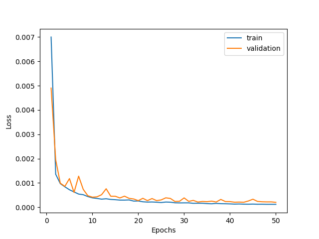
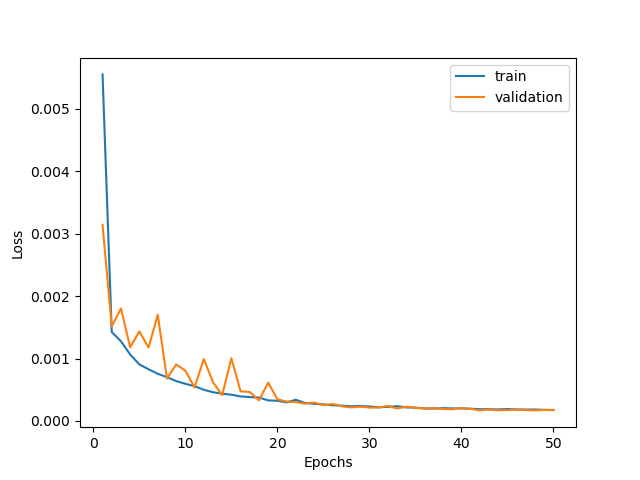

# Deep Learning for Cardiac Cine MRI Segmentation

**BME1312 Artificial Intelligence in Biomedical Imaging**
ShanghaiTech University
> Member: 熊闻野 夏博扬 杨人一 吴家兴 杨丰敏

---

## Overview

*   **Goal:** Segment key cardiac structures – Left Ventricle (LV), Right Ventricle (RV), and Myocardium (MYO) – from 2D cine MRI slices.
*   **Challenge:** Accurate and robust delineation of these structures, which can vary in shape and appearance.
*   **Approach:** U-Net based deep learning framework.
    1.  Baseline U-Net implementation.
    2.  Impact of removing U-Net skip connections.
    3.  Effect of data augmentation.
    4.  Comparison of Binary Cross-Entropy (BCE) vs. Soft Dice Loss.
    5.  Improvements.
*   **Evaluation:** Dice Similarity Coefficient (DSC).

---

## Data & Preprocessing

*   **Dataset:** `cine_seg.npz` 
    *   Contains 2D cardiac cine MRI slices and corresponding segmentation labels.
*   **Label Preprocessing:**
    *   Original single-channel labels (pixel values for classes) converted to 3-channel binary masks (one channel per class: RV, MYO, LV).
*   **Data Splitting:**
    *   Ratio: 4 (Train) : 1 (Validation) : 2 (Test).
    *   Batch Size: 32.
  
---

## U-Net Structure (1/2)

*   **Foundation:** Standard U-Net encoder-decoder architecture.
*   **Key Components:**
    *   `DoubleConv`: Two sequential (Conv2D 3x3 + BatchNorm2D + ReLU) blocks.
    *   `Down`: Max Pooling (2x2) + `DoubleConv` (Encoder path).
    *   `Up`: Upsampling + Concatenation (skip connection) with encoder features + `DoubleConv` (Decoder path).
*   **Parameters:**
    *   `C_base` (channels in first layer): 32.
    *   Downsampling Stages: 4.
    *   Input: 1 channel (grayscale MRI).
    *   Output: 3 channels (logits for RV, MYO, LV).

---

## U-Net Structure (2/2)

  <figure>
    
    <figcaption><em>Network</em></figcaption>
  </figure>

---

## Task (a): Baseline U-Net

*   **Network:** Standard U-Net with skip connections.
*   **Loss Function:** `MyBinaryCrossEntropy` (Sigmoid + `nn.BCELoss` per class).
*   **Optimizer:** Adam (lr=0.01), ExponentialLR scheduler.
*   **Training:** 50 epochs.

---

## Training Loss and validation Loss

  <figure>
    
    <figcaption><em>Baseline Loss</em></figcaption>
  </figure>

---

## Results: Dice Coefficients

| Structure | Mean Dice | Std. Dev. |
| :-------- | :-------- | :-------- |
| RV        | 0.9519    | 0.0086    |
| MYO       | 0.8734    | 0.0161    |
| LV        | 0.8920    | 0.0310    |

---

## Segmentation Examples (1/3)

  <figure>
    
    <figcaption><em> Baseline Segmentation Example LV</em></figcaption>
  </figure>

---

## Segmentation Examples (2/3)

  <figure>
    
    <figcaption><em> Baseline Segmentation Example MYO</em></figcaption>
  </figure>

---

## Segmentation Examples (3/3)

  <figure>
    
    <figcaption><em> Baseline Segmentation Example RV</em></figcaption>
  </figure>

---

## Comments

*    **RV Segmentation**: Achieved the highest mean Dice score. This is often expected as the RV is typically a large, relatively well-defined structure with good contrast against surrounding tissues in many MRI sequences.
*    **LV Segmentation**: Also showed good performance. The LV cavity is usually clearly visible.
*    **MYO Segmentation**: Had the lowest mean Dice score. The myocardium is a thinner, more complex structure surrounding the LV, and its boundaries, especially with the LV cavity (endocardium) and epicardium, can be more challenging to delineate accurately, potentially leading to lower overlap scores.
*    The standard deviations are relatively small, indicating consistent performance across the test slices.

---

## Task (b): U-Net without Skip Connections

*   **Modification:** `UNet_NoShortcut` using `Up_NoShortcut` modules (no concatenation from encoder).
*   **Training:** Same as baseline (BCE Loss, lr=0.01, 50 epochs).
*   **Purpose:** Evaluate the importance of skip connections.

---

## Training Loss and validation Loss (Baseline)

  

    
    
<em> Training and Validation Loss for Baseline U-Net.</em>

  

---

## Training Loss and validation Loss (No Short-cut)

  

    
    
<em> Training and Validation Loss for Baseline U-Net without shortcut.</em>

  

---

## Results: Dice Coefficients

| Structure | Baseline DSC | No Shortcut DSC |
| :-------- | :----------- | :-------------- |
| RV Mean   | 0.9519       | 0.9260          |
| MYO Mean  | 0.8734       | 0.8223          |
| LV Mean   | 0.8920       | 0.8588          |
| RV std   | 0.0086       | 0.0111          |
| MYO std  | 0.0161       | 0.0168          |
| LV std   | 0.0310       | 0.0296          |

---

## Discussion - Impact of No Skip Connections

*   **Significant Drop in Performance:** All structures showed a noticeable decrease in DSC.
*   **Reason:** Skip connections provide high-resolution spatial information from the encoder to the decoder, crucial for accurate boundary localization. They also aid gradient flow.
*   **Conclusion:** Skip connections are vital for U-Net's segmentation accuracy in this task.

---

## Task (c): U-Net with Data Augmentation

*   **Network:** Baseline U-Net architecture.
*   **Augmentations (Training Set Only):**
    *   `RandomHorizontalFlip`, `RandomRotation(15°)`,
    *   `RandomAffine(degrees=50, translate=(0.1,0.1), scale=(0.9,1.1), shear=5)`.
*   **Implementation:** `SegmentationDataset` ensuring identical transforms for image and mask.
*   **Training:** BCE Loss, lr=0.01, 50 epochs.

---

## Training Loss and validation Loss (Baseline)

  

    
    
<em> Training and Validation Loss for Baseline U-Net.</em>

  

---

## Training Loss and validation Loss (with Data Augmentation)

  

    
    
<em> Training and Validation Loss for Baseline with Data Augmentation.</em>

  

---

## Results: Dice Coefficients
| Structure | Baseline DSC | Data Aug. DSC |
| :-------- | :----------- | :------------ |
| RV Mean       | 0.9519       | 0.9276        |
| MYO Mean      | 0.8734       | 0.8469        |
| LV Mean       | 0.8920       | 0.8635        |
| RV std   | 0.0086       | 0.0107          |
| MYO std  | 0.0161       | 0.0149          |
| LV std   | 0.0310       | 0.0384          |

---

## Discussion - Impact of Data Augmentation

*   **Unexpected DSC Decrease:** The specific augmentation strategy led to slightly lower Dice scores.
*   **Possible Reasons:**
    *   Augmentation parameters might be too aggressive.
    *   Original dataset might be sufficient, or augmentations not perfectly matching test set variations.
---

## Task (d): U-Net with Soft Dice Loss

*   **Network:** Baseline U-Net architecture.
*   **Training Data:** Original Non-Augmented Training Set.
*   **Loss Function:** `SoftDiceLoss`
*   **Optimizer:** Adam (lr=0.001), ExponentialLR scheduler.
*   **Training:** 50 epochs.

---

## Training Loss and validation Loss (Baseline with BCE Loss)

  

    
    
<em> Training and Validation Loss for Baseline U-Net.</em>

  

---

## Training Loss and validation Loss (Baseline with soft Dice Loss)

  

    
    
<em> Training and Validation Loss for Baseline with  soft Dice Loss.</em>

  

---

## Results: Dice Coefficients

| Structure | Baseline with BCE Loss | Baseline with soft Dice Loss |
| :-------- | :--------| :------------|
| RV Mean       | 0.9519   | **0.9566**   |
| MYO Mean      | 0.8734   | **0.8962**   |
| LV Mean       | 0.8920   | **0.8998**   |
| RV std   | 0.0086       | 0.0100          |
| MYO std  | 0.0161       | 0.0100          |
| LV std   | 0.0310       | 0.0371          |

---

## Segmentation Examples (1/3)

  <figure>
    
    <figcaption><em> Baseline with Soft Dice Loss Segmentation Example LV</em></figcaption>
  </figure>

---

## Segmentation Examples (2/3)

  <figure>
    
    <figcaption><em> Baseline with Soft Dice Loss Segmentation Example MYO</em></figcaption>
  </figure>

---

## Segmentation Examples (3/3)

  <figure>
    
    <figcaption><em> Baseline with Soft Dice Loss Segmentation Example RV</em></figcaption>
  </figure>

---

## Task (e): Other Improvements

---

## Discussion

*   When trained on the same non-augmented data, **Soft Dice Loss significantly outperformed BCE Loss** in terms of Dice Coefficient for all structures.
*   The improvement is most notable for MYO segmentation.
*   This suggests that directly optimizing a Dice-based metric is beneficial for this segmentation task.

---

## Overall Performance Summary (Dice Coefficients)

| Model  | RV Mean DSC | MYO Mean DSC | LV Mean DSC |
| :-------------------------------------- | :---------- | :----------- | :---------- |
| (a) Baseline U-Net (BCE)                | 0.9519      | 0.8734       | 0.8920      |
| (b) U-Net No Shortcut (BCE)             | 0.9260      | 0.8223       | 0.8588      |
| (c) U-Net + Data Aug. (BCE)           | 0.9276      | 0.8469       | 0.8635      |
| **(d) U-Net (Soft Dice Loss)** | **0.9566**  | **0.8962**   | **0.8998**  |

The U-Net trained with Soft Dice Loss (on non-augmented data) achieved the highest Dice scores.

---
## Conclusion & Future Work

*   **Key Findings:**
    *   U-Net with **Soft Dice Loss (trained on non-augmented data) yielded the best segmentation performance** (Dice scores).
    *   Skip connections are crucial.
    *   The specific data augmentation strategy tested did not improve Dice scores over the baseline non-augmented models.
*   **Future Work:**

---

## Thanks!
